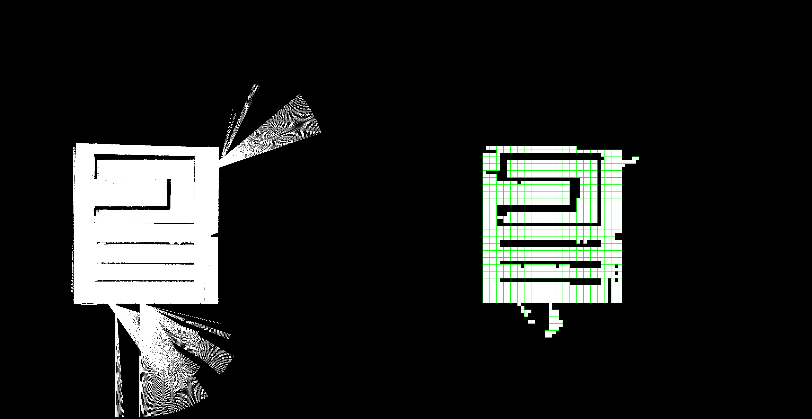
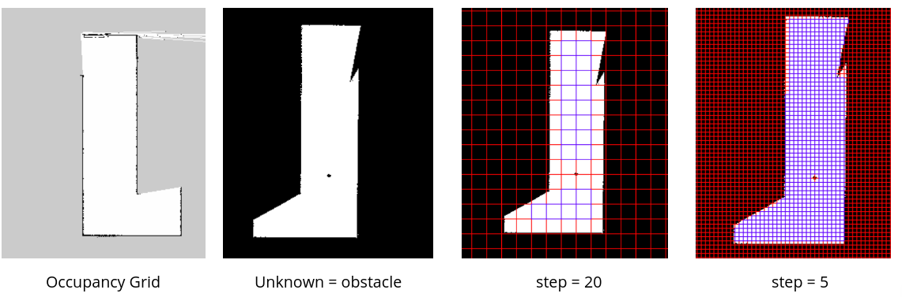
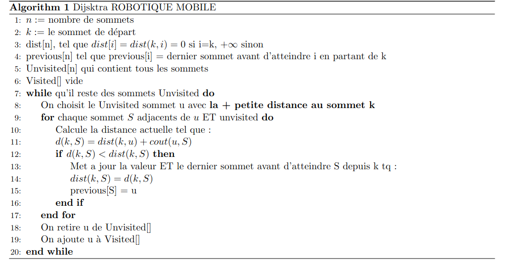
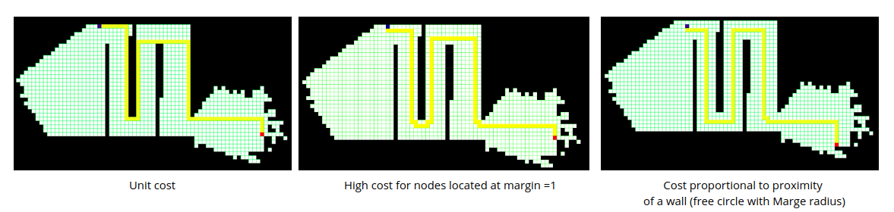
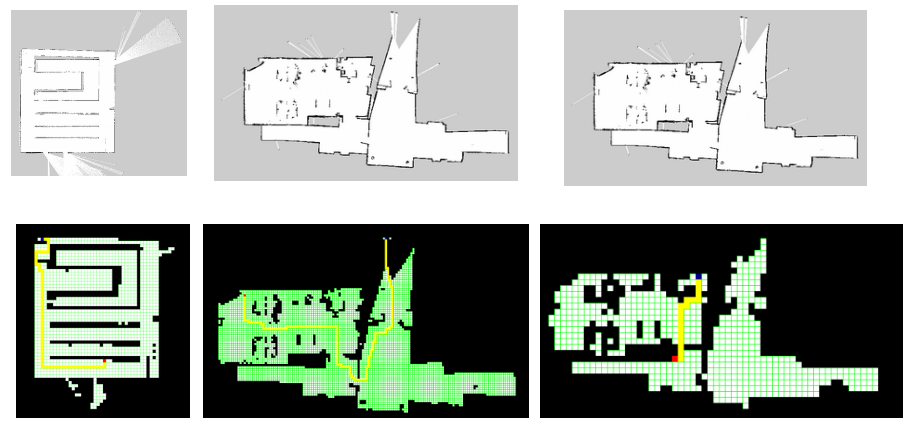
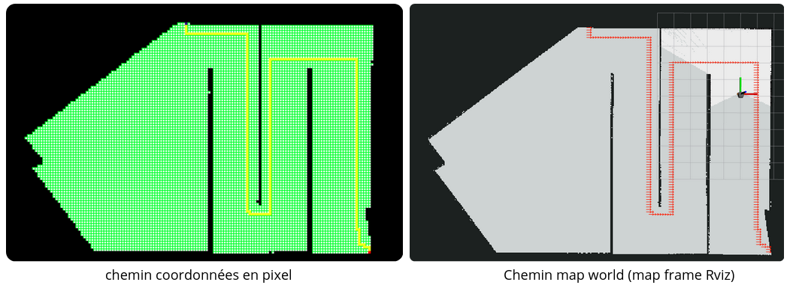
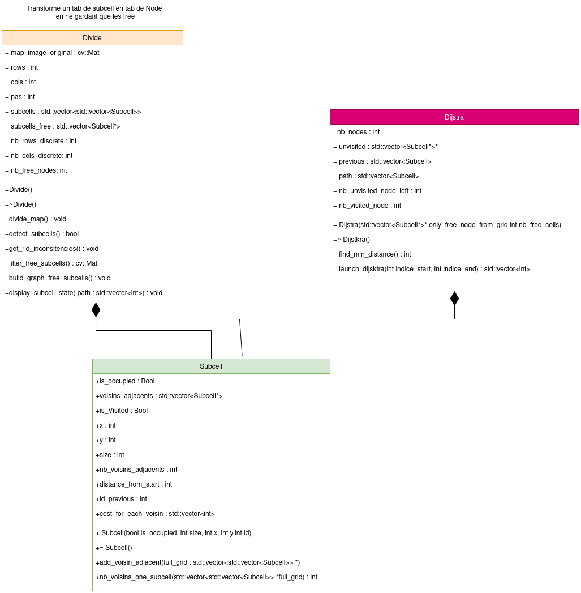
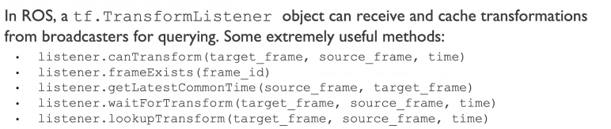

# :robot:Robotique Mobile : Path Planning et Map Building


| **Developpé sur**                                              |
| ------------------------------------------------------------ |
| 


> **Website Page Description [here]()

## :key: Mot clés
Robotique Mobile, Path Planning, ROS, C++


### :star: Objectif du projet :

- Exploration cartographique à l'aide du robot Pionneer avec un joystick.
- Implémenter un retour autonome à la base de chargement en utilisant la planification de trajectoire.

L'implémentation se fait sous __ROS NOETIC__ avec un robot monocycle équipé d'un LIDAR et d'encodeurs.


### :robot: Comment lancer la simulation :
```roslaunch my_map_processing all_in.launch ``` permet de lancer gazebo/map/rviz

**Pour lancer le noeud Dijsktra**


```rosrun path_planning_map offline _param_file:=PATH_TO_CONFIG_FILE```


Exemple :

```rosrun path_planning_map offline _param_file:=/home/spi-2019/robmob_ws/src/path_planning_map/config/config.yaml```

##:computer: 1) Path Planning :  Discretiser l'occupancy grid


Pour la discrétisation, nous divisons la grille d'occupation en grilles de taille PAS pixels. Si un pixel est noir (=obstacle), la cellule entière est considérée comme un obstacle.

__Resultats__


 

 


## :mechanical_leg: 2) Dijsktra

On implémente le pseudo code ci-dessous

 


### Résultats
 


 


## :mechanical_leg: 3) D'un chemin en pixels à un chemin en coordonnées dans le referentiel monde

Ici, on a un chemin en pixels, et on veut le convertir en coordonnées dans le referentiel monde. Pour cela, on utilise l'information ```origin``` donné par le fichier ```yaml``` fourni par ```map saver```. 




### :gear: Quelques commandes

| commande|A faire depuis| tâche|
| :---: | :---: | :---: |
| ```catkin_make ``` |``` ~/robmob_ws``` | Pour compiler|
| ```source devel/setup.bash``` |``` ~/robmob_ws``` | Pour sourcer|
| ```source ~/robmob_ws/devel/setup.bash``` |``` gedit ~/.bashrc``` | depuis bash|
| ```catkin_create_pkg my_teleop rospy roscpp sensor_msgs geometry_msgs``` |``` ~/robmob_ws/src``` | Creer un package avec les dependences|
| ```catkin_init_workspace``` |``` ~/robmob_ws/src``` | Intit |
| ```rospack find name_package``` |``` ``` | Pour localiser un package ROS|
| ```rostopic hz /map``` | | Pour connaitre la fréquence de publication|
| ``` killall gzserver ``` | | Pour fermer toute instance de gazebo|
| ``` rosrun map_server map_saver --occ 90 --free 10 -f map_rob_mob map:=/map ``` | | Pour enregistrerla map.pgm dans le chemin de map:=""|
| ``` rosrun rqt_tf_tree rqt_tf_tree ``` | | Visualiser les frames et leurs relations|
| ``` rosrun tf tf_echo <source_frame> <target_frame> [echo_rate] ``` | | Visualiser la transformation entre 2 frames|


### Annexe : Creer un package ROS C++

1- On lance la commande depuis ```ws/src```
```catkin_create_pkg my_teleop roscpp sensor_msgs geometry_msgs```

2- On va dans ```nom_package/src``` et on crée un fichier ```my_node.cpp```

3- Modifier le ```CMakeLists.txt``` pour ajouter le fichier ```my_node.cpp``` tel que :

- ``` find_package(catkin REQUIRED COMPONENTS roscpp sensor_msgs geometry_msgs)``` pour ajouter les dépendances. Ajouter la meme chose dans le ```package.xml```

- ```add_executable(my_node src/my_node.cpp)``` pour ajouter le fichier ```my_node.cpp``` dans le package

- ```target_link_libraries(my_node ${catkin_LIBRARIES})``` pour lier les librairies


### :hammer: Annexe : Ecrire un launch file

```
<?xml version="1.0" ?>
<launch>
   <node pkg="my_teleop" type="command.py" name="our_node" output="screen"/>
   <param name="joy_node/dev" value= "/dev/input/js0"/>
   <node pkg="joy" type="joy_node" name="joy_node" output="screen"/>
</launch>

```

Ce code signifie que l'on lance le noeud :
- situé dans le package ```my_teleop```
- de type ```command.py``` ( on met le nom du script python quand on lance un script python, le nom de l'executable quand on lance un executable)
- avec le nom ```our_node``` (on peut mettre TOTO)
- avec l'option ```output="screen"``` pour afficher les messages dans le terminal


###:hammer: Annexe : ajout d'open CV dans le package

But : on rajoute un noeud qui permet de lire les messages du topic ```/map``` de type ```nav_msgs/OccupancyGrid```. On affcihe la map dans une fenetre type opencv.

__Installation d'opencv__

-``` sudo apt install libopencv-dev```
- Rajouter dans le ```CMakeLists.txt``` :
```find_package(OpenCV)```
```include_directories(${OpenCV_INCLUDE_DIRS})```
```target_link_libraries(my_node ${catkin_LIBRARIES} ${OpenCV_LIBRARIES})```


 Voir ```map_process.cpp```


### :hammer: Annexe : COMMENT LANCER CHAQUE NOEUD/ FONCTION


- Lancer le Minilab simu
```roslaunch minilab_simulation minilab_simulation.launch```
Remarque : pour éviter de ralentir l'ordi, dans le fichier :
```minilab_simulation/launch/minilab_gazebo.launch``` , mettre la valeur de ```gui``` à ```false```

- Lancer gmapping
```rosrun gmapping slam_gmapping```

- Lancer la téléop via JOYSTICK (regarder le port)
```roslaunch my_teleop command_joystick.launch```


- Lancer la visu via OpenCV
```roslaunch my_map_processing map_processing.launch```


- Lancer la téléop via Clavier (un peu lent)
```roslaunch my_teleop keyboard.launch ```


## :hammer: Annexe : COMMENT LANCER rviz depuis un launch avec une config particulière

Le but est de pouvoir lancer rviz via le launch file, une fois tous les autres noeuds lancés. On voudrait que l'affichage rviz s'ouvre en affichant les topics qui nous interessent, __sans que l'on ait à cliquer et tout ouvrir par nous-même__

- Pour cela, ouvrir une fois rviz, avec les topics ouverts qui nous interessent (```/map```, ```/robot_model```,```/tf```)

- Faire ```save configuration``` (option proposée si on tente de fermer la fenêtre)

- Enregistrer le .rviz dans un fichier ```config/rviz```

- Dans le launch, ecrire :  ```  <node name="rviz" pkg="rviz" type="rviz" args="-d $(find NOM_PAQUET)/config/rviz/pionner_visu.rviz"/>```


## :hammer: Annexe : construire un CMAKE avec sa propre librairie

- Il faut ajouter la macro ```${PROJECT_NAME} ``` Dans le target link pour inclure les bibliothèques spécifiques à votre projet dans la liste des bibliothèques à lier. 

```target_link_libraries(map_process_node ${PROJECT_NAME} ${catkin_LIBRARIES} ${OpenCV_LIBS})```


## :hammer: Annexe : UML Objet Oriented Programming

<center></center>

## :hammer: Annexe : les TF

Quelques méthodes pour écrire les transformations entre les frames




## :warning: Annexe : Fichier config Yaml

Si jamais vous avez l'erreur 

```terminate called after throwing an instance of 'ros::InvalidNameException'
  what():  Character [-] at element [9] is not valid in Graph Resource Name [/home/spi-2019/robmob_ws/src/path_planning_map/config/config.yaml].  Valid characters are a-z, A-Z, 0-9, / and _.
Abandon (core dumped)
```


Alors il faut déclarer le noeud de cette manière ```ros::NodeHandle nh("~");``` et non ```ros::NodeHandle nh;```


# :s A eviter

- Avoir dans 2 packages différents, 2 executables de même nom !!

