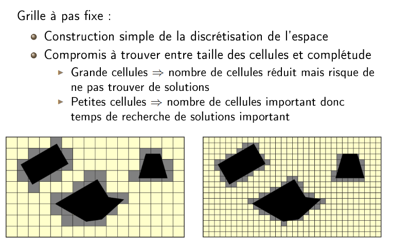

Tableau de commande :
| commande|A faire depuis| tâche|
| :---: | :---: | :---: |
| ```catkin_make ``` |``` ~/robmob_ws``` | Pour compiler|
| ```source devel/setup.bash``` |``` ~/robmob_ws``` | Pour sourcer|
| ```source ~/robmob_ws/devel/setup.bash``` |``` gedit ~/.bashrc``` | depuis bash|
| ```catkin_create_pkg my_teleop rospy roscpp sensor_msgs geometry_msgs``` |``` ~/robmob_ws/src``` | Creer un package avec les dependences|
| ```catkin_init_workspace``` |``` ~/robmob_ws/src``` | Intit |
| ```rospack find name_package``` |``` ``` | Pour localiser un package ROS|
| ```rostopic hz /map``` | | Pour connaitre la fréquence de publication|
| ``` killall gzserver ``` | | Pour fermer toute instance de gazebo|
| ``` rosrun map_server map_saver --occ 90 --free 10 -f map_rob_mob map:=/map ``` | | Pour enregistrerla map.pgm dans le chemin de map:=""|

### Un package ROS 
- dossier script = python
- dossier include
- dossier srv avec le src
- dossier launch
- .config 

__Creer un package ROS C++__

1- On lance la commande depuis ```ws/src```
```catkin_create_pkg my_teleop roscpp sensor_msgs geometry_msgs```

2- On va dans ```nom_package/src``` et on crée un fichier ```my_node.cpp```

3- Modifier le ```CMakeLists.txt``` pour ajouter le fichier ```my_node.cpp``` tel que :

- ``` find_package(catkin REQUIRED COMPONENTS roscpp sensor_msgs geometry_msgs)``` pour ajouter les dépendances. Ajouter la meme chose dans le ```package.xml```

- ```add_executable(my_node src/my_node.cpp)``` pour ajouter le fichier ```my_node.cpp``` dans le package

- ```target_link_libraries(my_node ${catkin_LIBRARIES})``` pour lier les librairies


### pour lancer le minilab, lancer la commande suivante :

```roslaunch minilab_simulation minilab_simulation.launch```

Remarque : pour éviter de ralentir l'ordi, dans le fichier :
```minilab_simulation/launch/minilab_gazebo.launch``` , mettre la valeur de ```gui``` à ```false```

### pour lancer le mapping, lancer la commande suivante :
```rosrun gmapping slam_gmapping```

### pour lancer la téléopération, lancer la commande suivante :
```roslaunch my_teleop command_joystick.launch```

- affichage Gazebo :


- affichage rqt :


#Ecrire un launch file

```
<?xml version="1.0" ?>
<launch>
   <node pkg="my_teleop" type="command.py" name="our_node" output="screen"/>
   <param name="joy_node/dev" value= "/dev/input/js0"/>
   <node pkg="joy" type="joy_node" name="joy_node" output="screen"/>
</launch>

```

Ce code signifie que l'on lance le noeud :
- situé dans le package ```my_teleop```
- de type ```command.py``` ( on met le nom du script python quand on lance un script python, le nom de l'executable quand on lance un executable)
- avec le nom ```our_node``` (on peut mettre TOTO)
- avec l'option ```output="screen"``` pour afficher les messages dans le terminal


# Seance 2

But : on rajoute un noeud qui permet de lire les messages du topic ```/map``` de type ```nav_msgs/OccupancyGrid```. On affcihe la map dans une fenetre type opencv.

## Installation d'opencv

-``` sudo apt install libopencv-dev```
- Rajouter dans le ```CMakeLists.txt``` :
```find_package(OpenCV)```
```include_directories(${OpenCV_INCLUDE_DIRS})```
```target_link_libraries(my_node ${catkin_LIBRARIES} ${OpenCV_LIBRARIES})```


<!-- ### Pour interface GRID MAP avec OPENCV
```sudo apt-get install ros-noetic-grid-map```
 -->


 Voir ```map_process.cpp```

# Seance 3

But en 2 étape :

- En partant d'un point de départ, explorer entièrement la carte par téléopération
- Une fois la carte entièrement explorée, le robot doit revenir au point de départ de manière autonome via algo de plannif

```roslaunch my_map_processing all_in.launch ``` permet de lancer gazebo/map/rviz





# Annexe : COMMENT LANCER CHAQUE NOEUD/ FONCTION


- Lancer le Minilab simu
```roslaunch minilab_simulation minilab_simulation.launch```

- Lancer gmapping
```rosrun gmapping slam_gmapping```

- Lancer la téléop via JOYSTICK (regarder le port)
```roslaunch my_teleop command_joystick.launch```


- Lancer la visu via OpenCV
```roslaunch my_map_processing map_processing.launch```


- Lancer la téléop via Clavier (un peu lent)
```roslaunch my_teleop keyboard.launch ```


# Annexe : COMMENT LANCER rviz depuis un launch avec une config particulière

Le but est de pouvoir lancer rviz via le launch file, une fois tous les autres noeuds lancés. On voudrait que l'affichage rviz s'ouvre en affichant les topics qui nous interessent, __sans que l'on ait à cliquer et tout ouvrir par nous-même__

- Pour cela, ouvrir une fois rviz, avec les topics ouverts qui nous interessent (```/map```, ```/robot_model```,```/tf```)

- Faire ```save configuration``` (option proposée si on tente de fermer la fenêtre)

- Enregistrer le .rviz dans un fichier ```config/rviz```

- Dans le launch, ecrire :  ```  <node name="rviz" pkg="rviz" type="rviz" args="-d $(find NOM_PAQUET)/config/rviz/pionner_visu.rviz"/>```

# A EVITER

- Avoir dans 2 packages différents, 2 executables de même nom !!